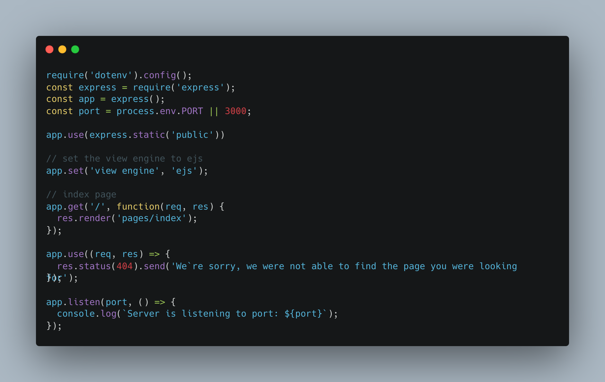
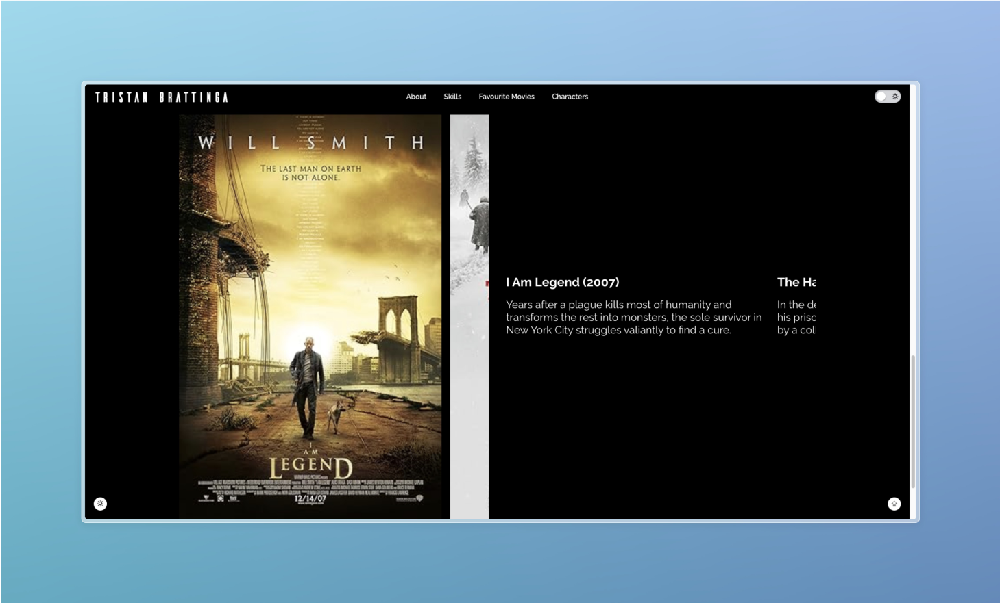
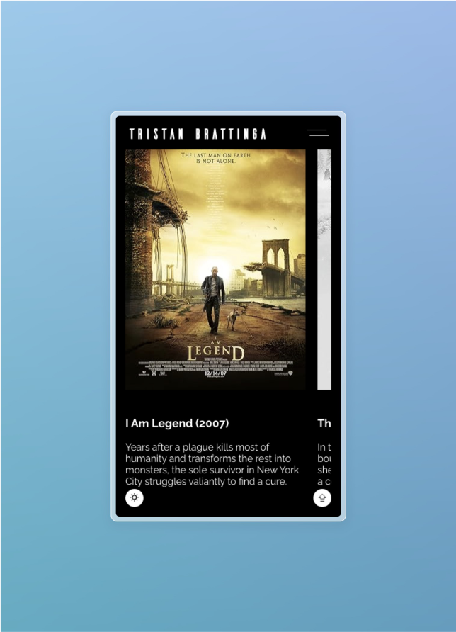
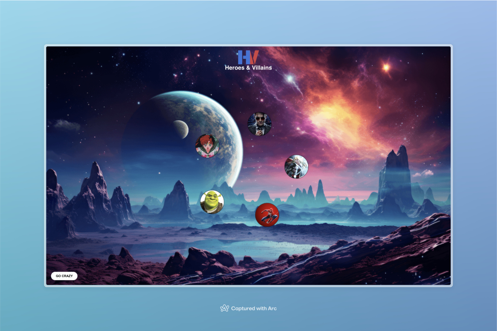
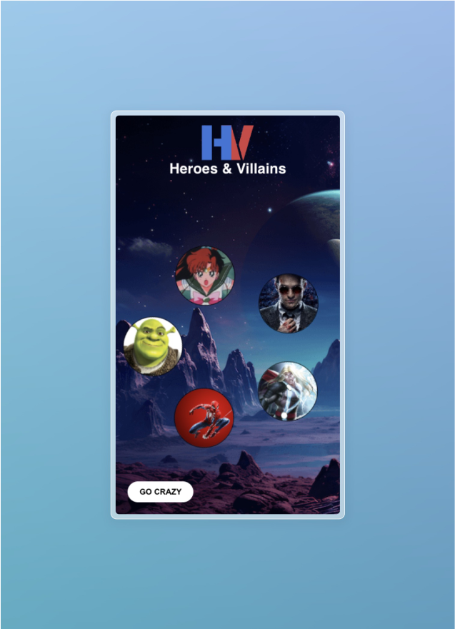

# Web apps from Scratch 2023/2024

[//]: # ()

## Introductie

Voor het vak Web apps from Scratch hebben we de opdracht gekregen om een single-page website te maken.
Het hoofddoel van de opdracht is om data op te halen van een externe bron. Deze data moet worden weergegeven
op jouw website, zodat jij in het tweede gedeelte van het vak deze data weer op kan halen in een team app.
Hieronder heb ik een schematisch overzicht gemaakt van de logica van de opdracht:


Aangezien ik al werkzaam ben als front-end developer, was dit een redelijk makkelijke opdracht voor mij.

Er zaten een aantal vereisten aan de opdracht. Zie vereisten hieronder:
<ul>
    <li>Minimaal 1 data-call door gebruik te maken van een API</li>
    <li>Gebruik van vanilla HTML, CSS & JS</li>
    <li>Minimaal 1 micro-interactie met JavaScript</li>
    <li>Volledig responsive</li>
    <li>Geen frameworks en libraries</li>
</ul>

## Week 1

---

Op maandag ben ik met mijn groepje begonnen met de idee-generatie voor onze team app. Wij willen een
web app gaan bouwen waar je ieders favoriete helden en schurken uit films, series, cartoons en anime's
kan zien. Het duurde best even voordat we het concept van de opdracht begrepen, maar dat is uiteindelijk helemaal
duidelijk geworden. Ieder bouwt zijn eigen one page web app, waarin we onze data moeten ophalen.
Uiteindelijk is het dan de bedoeling dat deze data wordt weergegeven in onze app. De teamapp zal een overkoepelende app
zijn waar al onze data in zal worden opgehaald. Op de eerste dag heb ik getest met het fetchen van data uit
een JSON-bestand. Dit ging heel gemakkelijk. Verder heb ik op maandag een basis webapp template opgezet,
bestaande uit de volgende mappenstructuur:

```
wafs/
├── docs/
│   ├── styles/
│   │   ├── style.css
│   └── index.html
└── README.md
```

Op dinsdag ben ik wat verder gaan werken aan mijn front-end. Ik heb wat Javascript geïntroduceerd om een
mobiel hamburger menu te kunnen gebruiken. Dit is mijn eerste stap richting responsiveness. Verder hebben
we later op de dag de keuze gekregen om een workshop bij te wonen. Oud-student/docent Bas de Greeuw gaf een
workshop over het inzetten van Oauth voor het gebruik van een Spotify API. We hebben hier zoals geleerd,
in blok tech een basic Node.js server opgezet, met het gebruik van een Express back-end. Dit ging voor mij
allemaal redelijk simpel. Hieronder zijn wat screenshots te zien van de code:

### server.js



Hieronder de mappenstructuur van mijn webapp op dit moment:

```
wafs/
├── data/
│   └── data.json
├── images/
├── public/
├── scripts/
│   └── server.js
├── styles/
│   └── style.css
├── views/
│   ├── pages/
│   │   └── index.ejs
│   └── partials/
│       ├── footer.ejs
│       ├── head.ejs
│       └── header.ejs
├── .env
├── .gitignore
├── .yarnnrc.yml
├── server.js
├── package.json
├── README.md
├── index.html
└── yarn.lock
```

Op woensdag ben ik begonnen met het deployen op Vercel. Ik wil mijn back-end en front-end in hetzelfde
project gaan deployen...... hie rnog meer neerzetten

### Micro-interactie

Voor de micro-interactie op mijn webpagina heb ik gekozen voor een dark/light mode toggle. Ik ben zelf een ongelofeljke
fan van dark mode, maar voor sommige mensen is het fijner of toegankelijker om ook een light mode te hebben. Vandaar dat
ik heb gekozen voor een dark/light mode toggle. Een dark/light mode toggle is op zich niet heel moeilijk, maar ik wilde
graag kijken of het mogelijk was om een blijvende state in te kunnen bouwen. Met hulp van
deze <a href="https://henryegloff.com/how-to-code-a-simple-dark-mode-toggle/">bron</a> heb ik mijn toggle gemaakt.
Het is mij uiteindelijk niet gelukt om ervoor te zorgen dat de darkMode state blijvend is. Ik weet niet wat hier fout
gaat, maar dit zoek ik een andere keer uit wanneer ik meer tijd heb.

De logica hierachter gaat als volgt:

1. Selecteer de body en de dark mode toggle;
2. In de localStorage wordt er een key: darkMode opgeslagen. Deze kan twee values hebben: dark en light;
3. Aan de hand van de button click wordt de functie toggleDarkMode() aangeroepen.
4. Als de key in de localStorage op dark staat wordt de value aangepast naar light en krijgt de body het data-attribuut
   light-mode='light' mee.
5. Als bovenstaande niet waar is krijg de key de waarde dark en wordt de value van het data-attribuut naar dark gezet.
6. In de css kan je dan het data-attribuut aanspreken met de juiste selector. Zie hiervoor de CSS code snippet.

De code:

```html

<body light-mode="dark">
....
</body>
```

``` javascript
const body                 = document.querySelector('body')
const darkModeButton       = document.querySelector('.darkModeToggle')

const toggleDarkMode = () => {
  if (localStorage.darkMode === 'dark') {
    localStorage.darkMode = 'light'
    body.setAttribute('light-mode', 'light')
  } else {
    localStorage.darkMode = 'dark'
    body.setAttribute('light-mode', 'dark')
  }
}

darkModeButton.addEventListener('click', toggleDarkMode)
mobileDarkModeButton.addEventListener('click', toggleDarkMode)
```

```css
body {
    background-color: black;
    transition: background-color .3s;
}

body[light-mode="light"] {
    background-color: white;
    color: black;
}

body[light-mode="light"] .darkModeToggle span:nth-child(1) {
    background-color: #35393C;
    color: white;
}

body[light-mode="light"] .darkModeToggle span:nth-child(2) {
    left: 35px;
    background-color: white;
}
```

---

## Week 2

In week 2 heb ik in de les vooral heel veel tijd besteed aan het bouwen van de teamapp en heb ik mijn individuele
website thuis verder afgemaakt waar mogelijk. Ik had mijn persoonlijke data al opgehaald en het zou iets uitdagender
zijn om nog een API te gebruiken. Zeker nadat het mij niet is gelukt om een back-end API op Vercel te hosten, moest ik
wel een andere API gebruiken. Omdat het thema van onze team app films was leek het mij leuk om de <a href="">OMDB
API</a> te gebruiken. Ik ben door de lijst van <a href="https://github.com/public-apis/public-apis">public-apis</a>
gegaan. Ik kon hier heel makkelijk een open ApiKey aanvragen met mijn e-mail. Deze kon ik in mijn fetch functie
insluiten en zo films en hun bijbehorende data ophalen.

Op de website van OMDB geven ze aan welke query parameters je kan gebruiken om films te zoeken, maar omdat ik meerdere 
films wil displayen wist ik niet zo goed hoe ik meerdere films tegelijkertijd kon queryen. Ik dacht dat je de 
verschillende films op de onderstaande manier kon chainen, maar dit lukte niet:

```
http://www.omdbapi.com/?apikey=12dd510b&t=return-of-the-jedi&t=the-hateful-eight/
```

Uiteindelijk heb ik een array gemaakt met daarin mijn favoriete films waar ik overheen map en deze dan dynamisch in de 
fetch string gooi. Zo krijg ik alsnog een array van de opgehaalde films terug. De opgehaalde filmdata sla ik dan weer op
in een array, die dan bestaat uit film objecten. Zie hieronder mijn fetch functie:

```javascript
const favouriteMovies = ['return-of-the-jedi', 'i-am-legend', 'avengers-endgame', 'the-hateful-eight']

// Empty array that will house the fetched movie data objects
let movies = []

// Function that maps over the favourite movies array and pushes them into the movies array
const fetchMovies = () => {
  favouriteMovies.map((movie) => {
    fetch(`http://www.omdbapi.com/?apikey=12dd510b&t=${movie}`)
      .then((res) => {
        if (!res.ok) {
          throw new Error
          (`HTTP error! Status: ${res.status}`)
        }
        return res.json()
      })
      .then((movieData) => {
        movies.push(movieData)
        return movies
      })
      .catch((e) => console.error('Unable to fetch data:', e))
  })
}
```

Deze opgehaalde data die in de movies array zit kan ik dan doorpassen aan mijn index EJS template op de onderstaande 
manier. 
```javascript
res.render('pages/index', { data: personalData, movies: movies })
```

In mijn EJS template kan ik dan over de movies array mappen en alle data los displayen:

```html
<article>
        <section>
            <ul class="movieImages">
                <% movies?.map(movie => { %>
                    <li>
                        ' alt=''>
                    </li>
                <% }) %>
            </ul>
        </section>
        <section>
            <ul class="movieInfos">
                <% movies?.map(movie => { %>
                    <li>
                        <h3>
                            <%= movie.Title %> (<%= movie.Year %>)
                        </h3>
                        <p>
                            <%= movie.Plot %>
                        </p>
                    </li>
                <% }) %>
            </ul>
        </section>
    </article>
```

Ik wilde graag twee sliders maken die gelinkt zijn aan elkaar. Dus als de index van de ene slide verandert moet de 
andere slider mee indexeren. Wat ik graag nog had willen implementeren was dat wanneer de gebruiker handmatig scrollt en
niet door middel van de navigatie buttons de andere slider mee zou bewegen. OBinnen mijn tijdsbestek was dit veels te 
uitgebreid en niet echt haalbaar. Nog iets wat een heel klein dingetje is wat niet binnen de tijd is gelukt, is het 
fixen van de dots index. Ik weet dat dit iets heel kleins en makkelijks is, maar doordat ik zelf helemaal gaar was heb 
ik ervoor gekozen om dit te laten. Hieronder is de JavaScript van mijn sliders te zien:

```javascript
/////////////// MOVIE SLIDER ///////////////

let currentIndex     = 0
// Since the images have fixed height make the scrollDistance the same as the slide width on mobile and desktop
const scrollDistance = window.innerWidth <= 768 ? 300 : 600

// Functtion to handle the active slide index to update the dots using an active class
const handleActiveIndex = () => {
  [...dots].map((dot, index) => {
    if (index === currentIndex) {
      dot.classList.add('active')
    } else {
      dot.classList.remove('active')
    }
  })
}

const handleSlidePrev = () => {
  if (currentIndex < slides.length + 1) {
    currentIndex--
  }
  sliderOne.scrollLeft -= scrollDistance
  sliderTwo.scrollLeft -= scrollDistance
  handleActiveIndex()
}

const handleSlideNext = () => {
  sliderOne.scrollLeft += scrollDistance
  sliderTwo.scrollLeft += scrollDistance
  handleActiveIndex()
}

// TODO check if possible
// const handleManualScroll = () => {
//   [...slides].map((slide, index) => {
//     const rect = slide.getBoundingClientRect()
//
//     console.log(rect.left, index)
//   })
// }

// sliderOne.addEventListener('scroll', handleManualScroll)
// sliderTwo.addEventListener('scroll', handleManualScroll)

prevButton.addEventListener('click', handleSlidePrev)
nextButton.addEventListener('click', handleSlideNext)
```

### Het resultaat

| Desktop                                              | Mobile                                              |
|------------------------------------------------------|-----------------------------------------------------|
|  |  |

## Team gedeelte

---

Aan het begin van het vak zijn wij ingedeeld in groepjes aan de hand van ervaring en kunnen. Ik was in mijn groepje de
'senior' en heb ongeschreven de rol van leider op mij gekregen/genomen. Ik ben zelf niet de beste leider, omdat ik hier
niet veel ervaring mee heb. Dit was voor mij best wel moeilijk. Hier vertel ik meer over in mijn reflectie. Op maandag
zijn wij begonnen met de idee-generatie voor onze team app. Wij willen een web app gaan bouwen waar je ieders favoriete
helden en schurken uit films, series, cartoons en anime's kan zien. Het duurde best even voordat we het concept van de
opdracht begrepen, maar dat is uiteindelijk helemaal duidelijk geworden. Wij hadden afgesproken om in de tweede week te
beginnen aan het bouwen van de teamapp. Ik ben hier toen mee begonnen en het dit eigenlijk tot de laatste dag zelf
verder afgemaakt, omdat de anderen ziek waren, er niet waren of druk bezig waren met hun individuele opdracht.

Ik vind dat ik zelf best wel wat vets heb neergezet voor de teamapp. Ik had eerst het idee om een hele simpele card
slider te maken, totdat ik een ingeving kreeg. Aangezien ons team Heroes & Villains heet en dit ook het thema is

Bart heeft uiteindelijk de documentatie geschreven en mij geholpen met de laatste finishing touches voor de
website. Ferhat heeft ervoor gezorgd dat onze website op een custom domain te vinden is. Dit is heel veel en ik heb daar
zelf totaal geen verstand van. Vooral heel nice dat we een eigen domein hebben: <a href="https://heroesandvillains.nl">
Heroes & Villains</a>. Martijn heeft op het laatst nog wat kleine aanpassingen gedaan voor wat responsiveness en
animatie-tweak.

### Eindresultaat:

| Desktop                                          | Mobile                                                 |
|--------------------------------------------------|--------------------------------------------------------|
|  |  |

## Reflectie

---

Ik vond dit vak op zich wel leuk, maar het was voor mij net iets te ondermaats. Ik heb wel geprobeerd om het
interessant voor mijzelf te maken door te proberen mijn Express app op Vercel te deployen, maar dit was veel te
tijdrovend voor de 1.5 week duur van dit vak. Ik weet niet of ik dit ooit nog zal proberen te doen, omdat het
vanuit Vercel al heel erg werd afgeraden en ik nooit buiten school met Express werk. Verder vond ik de les van
Bas en Marten heel erg leuk en kon ik het goed met hun vinden. Het geeft een goed gevoel wanneer je met een aantal
developers problemen probeert op te lossen en samen tot nieuwe inzichten komt.

### Persoonlijk

Op persoonlijk vlak heb ik geleerd dat ik eerst moet zorgen dat ik de minimale vereisten in mijn opdracht heb
verwerkt en dan verder ga met de nice to have's. Doordat ik graag hoog inschat, kan ik soms toch mijn tijd verkeerd
indelen. Als ik dit omdraai, kan ik mijzelf heel veel tijd en stress besparen.

### Technisch

Toen wij te horen kregen dat wij een Node.js app mochten opzetten met Express, was ik al veel enthousiaster.
We mochten werken met Oauth en sommige andere toepassingen. Doordat ik een Express app heb gemaakt, moet die
ook ergens live gezet worden. Het leek mij een leuk idee om dit met Vercel te gaan doen, maar dit bleek
uiteindelijk veel te moeilijk en onhandig te zijn. Ik heb hier best wat tijd aan "verspilt", maar het uitzoeken
was op zich wel leerzaam. Ook omdat ik hier 3 dagen aan heb besteed, heb ik geleerd om voortaan eerst aan de
minimale vereisten te werken en zorgen dat deze aanwezig zijn en dan verder werken. Dit is een belangrijke les
die ik hieruit heb meegenomen :sweat_smile:.

Ook heb ik mij toch op JavaScript gebied nog wat verbeterd, door constant te oefenen en kijken hoe iets beter kan.
Denk hierbij aan het herschrijven van fetches, logica voor interactie aan de client side, etc. Dit is altijd leerzaam.

Ook heb ik met het bouwen van de teamapp no best wel wat geleerd. Naar aanleiding van het hoorcollege van Kilian Valkhof
heb ik gewerkt met het HTML dialog element. Dit vond ik best wel leuk en een leerzame toepassing. Het gebruiken van
een modal is vaak voorkomende use case. Ik heb dit toegepast en zal ik vaker gaan gebruiken.

### Samenwerken

Ik ben iemand die niet een professional is in samenwerken, omdat ik vaak graag iets zelf wil doen. Ik weet dan
dat het goed wordt gedaan en dit moet ik soms leren los te laten. Ik vind het soms ook moeilijk om mijn ideeën te
communiceren naar mijn teamgenoten. Dit zijn punten waar ik aan moet gaan werken. Bij dit vak vond ik het zelf ook wel
heel moeilijk, omdat de mate van ervaring en kunnen ook wel heel erg ver uit elkaar lag. Ook was een gedeelte van mijn
teamgenoten vaak ziek en maakte dit het ook niet makkelijker. Ik zal hier op een bepaalde manier beter mee om moeten
gaan.

Na dit alles aangekaart te hebben bij mijn docenten, kreeg ik ook het inzicht dat als ik misschien meer de
rol van (bege)leider op mij had genomen, ook ik er meer van had kunnen leren. Op de laatste dag heb ik dit gelijk
geprobeerd toe te passen, door wat taken uit handen te geven en een kleine taakverdeling te maken. Dit is voor mij
een leerpuntje en zal ik beter moeten gaan doen. Al helemaal wanneer ik degene ben met de meeste kennis.
Ook ik kan leren van uitleg geven aan mijn mede-leerlingen.

## Bronnenlijst

---

- https://henryegloff.com/how-to-code-a-simple-dark-mode-toggle/
- https://www.omdbapi.com/